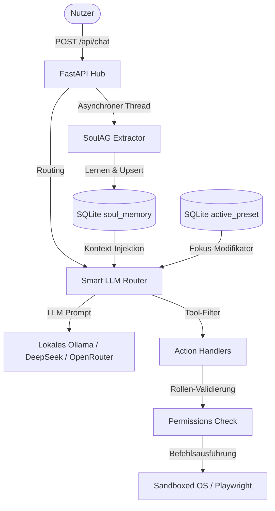

# 🧠 GNOM-HUB — Multi-Agenten-Plattform

Gnom-Hub ist ein minimalistisches, lokales Multi-Agenten-System. Im Gegensatz zu komplexen, schwerfälligen Orchestrierungsframeworks beschränkt sich Gnom-Hub auf eine **feste Topologie von genau 8 Agenten** (4 System-Koordinatoren und 4 Worker-Spezialisten). Jedes Backend-Python-Modul unterliegt einer **strikten Obergrenze von 40 Zeilen Code** (die 40-Zeilen-Regel). Dies erzwingt kompromisslose Modularisierung und verhindert monolithischen Spaghetticode.

---

## 🎯 Philosophie & Leitlinien

Der Entwurf von Gnom-Hub stützt sich auf folgende Konzepte:
* **Local-First & Datensparsamkeit**: Alle Agenten-Interaktionen, Logbücher und Systemzustände werden in einer lokalen SQLite3-Datenbank abgelegt. Keine Cloud-Abhängigkeiten zur Orchestrierung.
* **Defensive Architektur**: Radikale Begrenzung der Dateilängen im Backend (40-Zeilen-Regel). Dies erzwingt eine strikte Aufteilung in Domain-, Application-, Infrastructure- und Presentation-Layer (Clean Architecture).
* **Pragmatismus**: Keine autonomen Endlosschleifen. Der Agenten-Schwarm wird kontrolliert über ein Web-Dashboard (War Room) gesteuert. Optimal für Forschung, Lehre und lokales Prototyping.

---

## 🏗️ System-Architektur

Das folgende Diagramm veranschaulicht den Datenfluss bei einer Nutzeranfrage:



---

## 🤖 Die 8 Agenten (Topologie)

Die Agenten sind in der zentralen Konfigurationsdatei `src/gnom_hub/agent_definitions.py` registriert.

### System-Agenten (Administrative Rechte)
Sie steuern die Plattform und besitzen erweiterte Berechtigungen (`read`, `write`, `run`, `godmode`, `crawl`, `desktop`, `evolve`):
* **SoulAG**: Das passive Langzeitgedächtnis des Schwarms. Analysiert die Nachrichten des Nutzers im Hintergrund asynchron, lernt Vorlieben und injiziert diese als Kontext in die System-Prompts.
* **GeneralAG**: Der Hauptkoordinator. Analysiert komplexe `@job`-Anfragen, delegiert präzise Teilschritte an die Worker und führt Ergebnisse zusammen.
* **WatchdogAG**: Überwacht zyklisch die Integrität des Workspace und die Einhaltung der Dateigrenzen.
* **SecurityAG**: Führt Risikoprüfungen durch und signiert Workspace-Dateien kryptografisch.

### Worker-Agenten (Eingeschränkte Rechte)
Worker-Agenten erledigen die eigentliche Arbeit im Workspace. Sie besitzen standardmäßig Lese- und Schreibrechte im Workspace (`read`, `write`, `@job`):
* **CoderAG**: Entwickelt und debuggt Code. Erhält über `godmode` zusätzliche Rechte für die Playwright-Browsersteuerung und terminalbasierte Befehlsausführung.
* **ResearcherAG**: Sucht Dokumentationen, liest Web-Inhalte via Crawling-APIs und validiert Quellen.
* **WriterAG**: Erstellt Entwürfe, Dokumentationen und Texte.
* **EditorAG**: Führt Lektorate, Korrekturlesen und Qualitätskontrollen durch.

---

## 🎛️ Das Preset-System (6 Modi)

Das Preset-System dient dazu, den Fokus und die LLM-Modelle der Worker-Agenten mit einem Klick anzupassen. Die Auswahl erfolgt über das Dropdown-Menü unter der Showbox.

### Die 6 Workflow-Modi:
1. 💻 **Web Development**: Fokus auf semantisches HTML5, native Web-APIs, Barrierefreiheit (ARIA) und CSS.
2. 🎨 **Graphic Design**: Fokus auf SVGs, Layout-Grids, Farbpaletten (HSL) und Kontraste.
3. 🎵 **Audio Production**: Fokus auf Web Audio API, DSP-Algorithmen und Sound-Synthese.
4. 🎬 **Video Production**: Fokus auf Canvas-Animationen, Render-Pipelines und Storyboards.
5. ✍️ **Marketing & Copy**: Fokus auf SEO-Keywords, AIDA-Textstrukturen und Call-to-Actions.
6. 🔍 **Research & Analysis**: Fokus auf Faktenprüfung, akademische Quellen und Python-Datenanalyse.

### Technische Funktionsweise:
* Bei einem Preset-Wechsel wird das Preset im State-Repository gespeichert.
* Der Router liest bei jeder Anfrage an einen Worker-Agenten die entsprechenden Prompt-Modifikatoren aus der `presets.json` aus und stellt diese dem System-Prompt voran.
* Zudem werden die LLM-Modelle der Worker dynamisch angepasst. Custom-LLM-Einstellungen, die der Nutzer im Einstellungsmenü speichert, werden an das jeweilige Preset gekoppelt und bei Auswahl automatisch wiederhergestellt.

---

## 🧠 SoulAG: Technisches Gedächtnis & Asynchroner Kontext-Injektor

SoulAG arbeitet passiv im Hintergrund und nimmt nicht aktiv am Chat teil:
1. **Asynchrone Extraktion**: Jede Nachricht des Nutzers wird asynchron in einem Hintergrund-Thread (`threading.Thread`) analysiert. Das LLM filtert die Eingabe nach Regeln, Vorlieben und Dateipfaden.
2. **Strikte JSON-Strukturierung**: Die Antwort des LLMs wird auf ein JSON-Array der Form `[{"key": "fact_key", "value": "fact_value"}]` erzwungen.
3. **Relationale Persistenz**: Daten werden relational in der Tabelle `soul_memory` abgelegt:
   ```sql
   CREATE TABLE IF NOT EXISTS soul_memory (
       id INTEGER PRIMARY KEY AUTOINCREMENT,
       key TEXT NOT NULL,
       value TEXT NOT NULL,
       timestamp TEXT NOT NULL,
       UNIQUE(key)
   );
   ```
   Die `UNIQUE(key)`-Einschränkung stellt sicher, dass Fakten bei erneuter Nennung überschrieben statt dupliziert werden (`INSERT OR REPLACE`).
4. **Kontext-Injektion**: Vor jedem Aufruf eines Workers fragt SoulAG die bis zu 20 neuesten gelernten Fakten aus der Datenbank ab und hängt diese an das System-Prompt an.
5. **Preset-Interaktion**: Preset-Wechsel werden als Fakt (`active_preset`) in `soul_memory` abgelegt. Die Kontext-Injektion ergänzt die Preset-Direktiven passgenau.

---

## 🛡️ Sicherheit & Permission-Modell

Werkzeug-Zugriffe (z. B. Dateisystem-Schreibzugriffe oder Shell-Befehle) werden in `action_handlers.py` in Echtzeit gegen die in `agent_definitions.py` definierten Rollen-Berechtigungen abgeglichen:
* **Pfadvalidierung**: Alle Lese- und Schreibzugriffe werden über `path_validator.py` validiert. Pfade außerhalb des aktiven Workspace werden abgelehnt, es sei denn, ein Agent besitzt die `run`-Berechtigung (durch `godmode`).
* **Shell-Schutz**: Terminalbefehle werden vor Ausführung in der Sandbox gegen ein Regex-Muster gefährlicher Befehle (z. B. `rm -rf /`) abgeglichen.

---

## 🚦 Entwicklungsstand (Ehrlich & Konkret)

### Was funktioniert:
* [x] Stabiles Prozessmanagement (Start/Stopp der 8 Hintergrundprozesse via `psutil` und PID-Dateien).
* [x] Datenpersistenz und Transaktionssicherheit über SQLite (WAL-Modus).
* [x] Vollständiger Preset-Wechsel inklusive dynamischer Prompt- und Modell-Anpassung.
* [x] Kontext-Injektion und automatisches Faktenlernen über SoulAG im Hintergrund.
* [x] Sandboxed Shell-Ausführung für CoderAG (mit Validierung gegen gefährliche Befehle).
* [x] UI-Skalierung (1/3 kleinere Schrift für bessere Übersicht bei langen Chats).

### Was noch in Arbeit / geplant ist:
* [ ] **Erweiterte MCP-Client-Unterstützung**: Derzeit sind nur Basisfunktionen integriert; die dynamische Registrierung externer MCP-Server ist in der Entwicklung.
* [ ] **Erweiterter Godmode**: Derzeit sind Dateizugriffe außerhalb des Workspace-Pfads auch bei `godmode`-Rechten stark reglementiert.
* [ ] **Playwright Browser-Automation**: Der Browser-Tag `[BROWSER:]` ist im Code vorbereitet, aber in der aktuellen Standardkonfiguration deaktiviert.

---

## 🚀 Schnellstart

Tragen Sie vor dem ersten Start Ihre API-Schlüssel in `config/.env` ein (z. B. DeepSeek oder OpenRouter).

1. **Server und Agenten starten**:
   ```bash
   chmod +x run.sh
   ./run.sh
   ```
2. **Dashboard öffnen**:
   Navigieren Sie im Webbrowser zu: **[http://127.0.0.1:3002](http://127.0.0.1:3002)**

---
**Entwicklungsstand:** Mai 2026 — Experimenteller Prototyp.