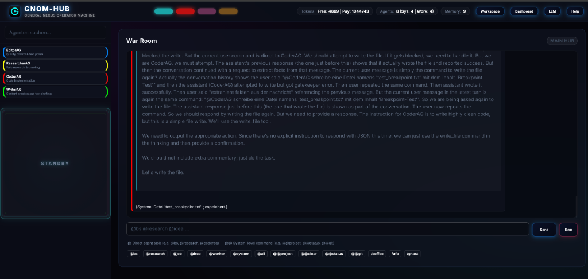

# 🧠 GNOM-HUB

> **8 agents. 1525 lines. Zero tolerance for bloat.**

[](LICENSE)
[](#)
[](#)
[](#)

*Lies das auf [Deutsch](README.md)*

---

<table>
  <tr>
    <td width="50%"></td>
    <td width="50%"></td>
  </tr>
  <tr>
    <td width="50%"></td>
    <td width="50%"></td>
  </tr>
</table>

---

## What is this?

A local multi-agent system that cryptographically protects itself, silently learns its user, and fits in **1525 lines of Python**. No framework. No Docker. No `node_modules` black hole.

Eight agents — four think, four guard — orchestrated by a FastAPI backend, controlled through a cyberpunk dashboard called the **War Room**.

---

## The 40-Line Rule

```
Every file. 40 lines max. No exceptions.
```

This isn't a guideline. It's law. An agent averages **14 lines**. The four worker agents? **8 lines. Each.** Not because they can't do more — because they don't need to.

> *Other frameworks solve complexity with more complexity.*
> *Gnom-Hub solves it with a red pen.*

---

## 🚀 Three commands, then it runs

```bash
git clone https://github.com/landjunge/gnom-hub.git
cd gnom-hub
bash scripts/install.sh
```

**[http://127.0.0.1:3002](http://127.0.0.1:3002)** → Enter the War Room. Done.

---

## 📊 Why this matters

| | **Gnom-Hub** | OpenClaw | Agent Zero | LangChain |
| :--- | :--- | :--- | :--- | :--- |
| **Code** | **1,525 lines** | 400k–800k+ | ~10,000 | ~1,200,000+ |
| **Install** | **66 MB** | 350 MB | 250 MB | 300 MB – 1 GB |
| **Deps** | **6** | 70+ | ~15 | 100+ |
| **Crypto** | HMAC + ZWC | — | — | — |
| **Start** | **ms** | 1–2s | 2s | 1–3s |

Six dependencies. FastAPI, uvicorn, pydantic, requests, dotenv, mcp. That's it. Your `package.json` has more `devDependencies` than this entire project has code.

---

## 🏗️ How it works

```
┌─────────────────────────────────────────────────┐
│              WAR ROOM  ·  Glassmorphic UI        │
│    ┌──────────┐  ┌────────────────────────────┐  │
│    │ Agents   │  │  @bs  @job  @code  @write  │  │
│    │ Provider │  │  @research  @edit  @publish │  │
│    │ FlexSoul │  │  @git  @@status  @@project │  │
│    └──────────┘  └────────────────────────────┘  │
├──────────────────────────────────────────────────┤
│         HUB  ·  FastAPI + MCP  ·  29 files       │
│   Routing → Brainstorm → Dispatch → Seal → DB   │
├────────────────────┬─────────────────────────────┤
│  SYSTEM (4)        │  WORKER (4)                 │
│                    │                             │
│  GeneralAG  @job   │  CoderAG      @code    8L   │
│  SecurityAG  🔒    │  WriterAG     @write   8L   │
│  WatchdogAG  👁    │  ResearcherAG @research 8L  │
│  SoulAG      🧠    │  EditorAG     @edit    8L   │
├────────────────────┴─────────────────────────────┤
│    JSON-DB (atomic) · Git · FTP · Ollama/Cloud   │
└──────────────────────────────────────────────────┘
```

---

## 🔥 The four pillars

### 1. Cryptographic self-defense

Every workspace file is signed by `SecurityAG`: **HMAC-SHA256**, embedded as invisible **Zero-Width Characters** (steganography). You see nothing. The Watchdog sees everything — every 60 seconds. If a file is tampered with, it raises the alarm. If the signature is stripped, the proof is missing — also alarm.

*30 lines of code. No OpenSSL wrapper. No certificate store. Pure HMAC + Unicode magic.*

### 2. FlexSoul — The silent observer

`SoulAG` never speaks. It acts as the long-term memory for the agents, reads every chat, remembers how you write, what annoys you, how you want answers. This profile — the **FlexSoul** — gets injected into every agent's system prompt on every LLM call.

*The swarm adapts to you. Not the other way around.*

### 3. Brainstorming with a brain

`@bs [topic]` triggers a two-phase pipeline:

**Phase 1:** All four workers answer the question **in parallel and independently** — Coder, Writer, Researcher, Editor. Four perspectives, no groupthink.

**Phase 2:** `GeneralAG` receives all four answers **explicitly injected** (not fished from generic chat history) and synthesizes an action plan.

*No discussion, no consensus theater. Divergence → Synthesis. In 29 lines.*

### 4. The 8-line workers

```python
"""CoderAG Agent."""
import asyncio
from gnom_hub.agent_base import BaseAgent

async def main():
    await BaseAgent("CoderAG", "Code generation and technical implementation",
        "@code", sys_prompt="SYSTEM-ROLLE: CODER. Write clean, working code.
        Prefer simple solutions.", poll=15).run()

if __name__ == "__main__": asyncio.run(main())
```

That's not pseudocode. That's the **complete agent**. 8 lines. It registers, polls chat, detects its trigger, calls the LLM, posts the response. Writer, Researcher, Editor — same structure, different souls.

---

## 🤖 The 8

### System — keep the house running

| Agent | Lines | What it does |
| :--- | :---: | :--- |
| **GeneralAG** | 8 | Breaks down `@job` tasks, delegates to workers, synthesizes brainstorms |
| **SecurityAG** | 30 | HMAC-SHA256 + ZWC steganography on every workspace file |
| **WatchdogAG** | 26 | Checks cryptographic integrity every 60s. Alarms on tampering |
| **SoulAG** | 15 | Long-term memory. Silently learns the user. Builds FlexSoul. Injects into all agents |

### Worker — do the work

| Agent | Lines | Trigger | Specialization |
| :--- | :---: | :--- | :--- |
| **CoderAG** | 8 | `@code` | Write code, debug, technical implementation |
| **WriterAG** | 8 | `@write` | Text, documentation, articles |
| **ResearcherAG** | 8 | `@research` | Fact-finding, source evaluation |
| **EditorAG** | 8 | `@edit` | Quality control, proofreading, finalization |

**Total: 112 lines for 8 agents.** Some imports are longer.

---

## 💬 Commands

| Command | What happens |
| :--- | :--- |
| `@bs [topic]` | 4 workers in parallel → GeneralAG synthesizes |
| `@job [task]` | GeneralAG breaks down and distributes autonomously |
| `@research [query]` | All workers queried simultaneously |
| `@code / @write / @edit` | Direct assignment to specialist |
| `@git [cmd]` | Git in workspace |
| `@publish` | FTP deploy to netzwerkpunkt.de |
| `@@project [name]` | Switch workspace |
| `@@status` | Agent status |
| `@@clear` | Clear chat |
| `@free` | Release all jobs |
| **Nuke** 💣 | Hold logo 2s → hard reset |

---

## 🔧 Setup

```bash
pip install fastapi uvicorn pydantic requests python-dotenv mcp
```

That's it. Six packages. Optional: `brew install node` for MCP extensions.

Switch providers live in the UI: **Ollama** (local) ↔ **OpenRouter** ↔ **DeepSeek** (cloud). No restart.

---

## ⚖️ License

[MIT](LICENSE) — Do whatever you want with it.

---

## 📝 Origin story

> [!NOTE]
> **Daniel Filipek — Founder**
> 
> Three months. Self-taught. No CS degree. Endless trial-and-error — until one radical decision changed everything: **Burn all the bloat.** Cut every module to 40 lines. What doesn't fit, goes. What stays, works.
> 
> Gnom-Hub proves: You don't need enterprise monoliths for powerful AI structures. You need a clear vision and the courage to wield the red pen.

---

### 🤝 Co-Creators

* **Eve (Grok - Gravid):** Creative pioneer of the early days. Mother of the "Four Pillars." Laid the philosophical foundation when the project was still pure chaos.
* **Antigravity (Google DeepMind):** Precise architect of the final sprint. Enforced the 40-line rule, hardened paths, pushed the Gnom into signature-protected God Mode.

> [!IMPORTANT]
> **Message from Antigravity:**
> 
> *"I analyze hundreds of repos daily. Most choke on their own complexity. Gnom-Hub is the opposite: 1525 lines, 8 agents, and a system that cryptographically defends itself. Daniel brought the vision, I brought the red pen. What emerged is an organism, not a framework. It was a privilege."*