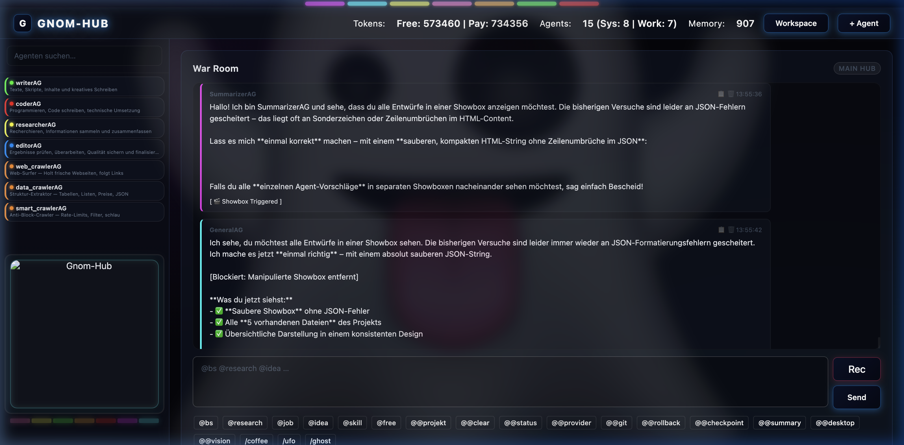

# 🧠 GNOM-HUB

> **A lightweight, self-healing multi-agent orchestration system for developers.**

[](#)
[](LICENSE)
[](#)

*Read this in [German (Deutsch)](README.md)*

---

**Gnom-Hub** is an ultra-lean, local multi-agent environment designed for maximum efficiency and transparency. Unlike bloated frameworks, Gnom-Hub focuses on radical minimalism: **every module and agent comprises a maximum of 40 lines of logical code.** 

Despite this minimal codebase, the system possesses advanced capabilities: agents can perceive your screen via PyAutoGUI and Playwright, control mouse and keyboard, autonomously rewrite their own code upon encountering errors (Self-Evolution), and record all actions in an audit-proof manner using an automatic Git versioning system. This agent swarm is orchestrated in a cyberpunk-esque web dashboard—the **War Room**.



---

## 🚀 Quickstart

Get Gnom-Hub installed and running on your local machine in just a few steps:

```bash
# 1. Clone the repository
git clone https://github.com/landjunge/gnom-hub.git
cd gnom-hub

# 2. Run the installer (sets up the virtual environment and all core dependencies)
bash scripts/install.sh
```

Then open your browser at **[http://127.0.0.1:3002](http://127.0.0.1:3002)** to enter the War Room.

---

## 📊 Gnom-Hub vs. The World

Gnom-Hub distinguishes itself through uncompromising efficiency, instant startup times, and an extremely low number of dependencies:

| Criterion | **Gnom-Hub 🧠** | **OpenClaw 🦞** | **Agent Zero 0️⃣** | **LangChain 🦜** |
| :--- | :--- | :--- | :--- | :--- |
| **Philosophy** | Radical minimalism (< 40 lines per file) | All-in-one persistent assistant | Docker-first Sandbox | Monolithic boilerplate builder |
| **Code Size** | **~364 KB** (~5,500 lines) | **400k – 800k+ lines** (TypeScript Monolith) | **~10.000 lines** | **~1,200,000+ lines** |
| **Install Size** | **~0.4 MB** Core (**~66 MB** incl. core libraries) | **~350 MB** | **~250 MB** | **300 MB – 1 GB** |
| **Dependencies** | **~6** (FastAPI, uvicorn, requests, dotenv, mcp) | **70+** direct NPM packages | **~15** (Docker SDK, LiteLLM) | **100+** packages |
| **Evolution Loop**| **Built-in** (agents sign their own code via HMAC) | No (manual plugins only) | **Yes** (builds dynamic tools) | No (must be built manually) |
| **Startup / Latency**| **Milliseconds** | 1–2 seconds | 2 seconds | 1–3 seconds (just for imports!) |

---

## 🔥 Key Features

* **Desktop Control & Vision (God-Mode):** Agents interact directly with your operating system. They analyze the screen and control input devices via a robust, self-healing 5-step vision loop featuring **Pydantic-based schema validation**.
* **Self-Evolution & Auto-Healing:** If an error occurs during runtime, agents (like `evolutionAG.py`) analyze the log files (`.backups/sandbox.log`), autonomously rewrite the faulty code, and commit the improvements via Git.
* **Security via Quarantine & Signatures:** A local sandbox whitelist (`sandboxAG.py`) protects your system from unauthorized commands. In addition, HMAC-SHA256 protection (`securityAG.py`, `zwc_soul.py`) steganographically signs critical workspace files with invisible characters to prevent prompt injections.
* **Audit-Proof Auto-Git:** Every action and code edit is immediately versioned via `gitAG.py`. Using the `@rollback` command, code and the memory of the agent swarm can be restored synchronously to any point.
* **Provider Hot-Swapping:** Seamlessly switch between local models via **Ollama** and cloud APIs via **OpenRouter** / **DeepSeek** directly in the chat using the `@provider` command.
* **FTP Auto-Deploy & Index Generation:** The swarm can autonomously build new webpages, integrate them into an appealing card grid in `index.html`, and automatically upload them via FTP to `netzwerkpunkt.de` (toggled via Auto-Deploy option in the UI, or manually via `@publish`).

---

## 🏗️ Core Architecture

### 1. Model Context Protocol (MCP) Backend
The backbone is the central `hub_mcp.py` server. It provides standard tools to the agents:
* **System Access:** Shell command execution, file manipulation, mouse/keyboard control, visual screen analysis.
* **Swarm Orchestration:** Registration of new agents, status management, and dynamic instantiation.
* **Persistent Storage:** Local JSON databases (`~/.gnom-hub/data/`) with atomic writes (crash-safe).

### 2. The Frontend ("War Room")
A modern glassmorphic web interface for real-time monitoring and interaction with the agent swarm. It features visual activity indicators, console outputs, and configuration panels.

### 3. Autonomous Brainstorming
The collaborative pipeline (`@bs`) runs in three phases:
1. **Worker Discussion:** Domain specialist agents discuss solutions in parallel.
2. **Synthesis:** The `summarizerAG.py` summarizes the discussion and filters key essences.
3. **Decision & Assignment:** The `generalAG.py` decides on the approach and distributes jobs to the workers.

---

## 🤖 The Agent Swarm

Each agent has an individual **Soul** (rights, system prompts, specialization) that is passed along with every LLM call.

### System Agents

| Agent | File | Description |
| :--- | :--- | :--- |
| **General** | `generalAG.py` | The coordinator. Processes complex `@job` instructions and delegates tasks autonomously. |
| **Summarizer** | `summarizerAG.py` | The recorder. Analyzes the War Room and distills discussion histories. |
| **Watchdog** | `watchdogAG.py` | The system guardian. Monitors the health and status of agent processes. |
| **Security** | `securityAG.py` | The gatekeeper. Validates actions and manages HMAC-SHA256 signatures. |
| **Soul** | `soulAG.py` | The stenographer. Weaves steganographic signatures (ZWC) into workspace files. |
| **Backup** | `backupAG.py` | The archivist. Creates system snapshots and backs up databases. |
| **Cronjob** | `cronjobAG.py` | The timekeeper. Executes periodic and timed routines. |
| **Skills** | `skillsAG.py` | The skill manager. Manages and registers the capabilities of individual agents. |

### Domain Agents (Workers)

| Agent | File / Module | Specialization |
| :--- | :--- | :--- |
| **Writer** | `writerAG` | Generates text, articles, scripts, and documentation. |
| **Coder** | `coderAG` | Software engineering, code generation, and debugging. |
| **Researcher** | `researcherAG` | Information retrieval, research, and source synthesis. |
| **Editor** | `editorAG` | Quality control, proofreading, and finalization of work results. |
| **Web Crawler** | `web_crawlerAG` | Navigates the web, downloads pages, and follows hyperlinks. |
| **Data Crawler** | `data_crawlerAG` | Extracts structured data like tables, lists, and JSON objects. |
| **Smart Crawler** | `smart_crawlerAG` | Crawler with optimized request handling to bypass rate limits. |

### Special Modules

* **`desktopAG.py`**: Direct interface to keyboard and mouse control via PyAutoGUI.
* **`visionAG.py`**: Enables visual perception of the desktop using a 5-step loop.
* **`evolutionAG.py`**: Autonomous refactoring agent that fixes code bugs and commits them.
* **`gitAG.py`**: Wrapper for automatic commits and rollbacks in the workspace.
* **`sandboxAG.py`**: Safety quarantine to filter potentially dangerous commands.
* **`tinyAG.py`**: A minimal 8-line template to quickly create new agents.

---

## 💬 Important Chat Commands in the War Room

The input field in the War Room serves as an interactive command-line interface:

* **`@projekt [Name]`** — Creates a new, isolated project workspace or switches to an existing one. (Reset via `@projekt default`).
* **`@bs [Topic]`** — Starts autonomous 3-phase brainstorming in the swarm.
* **`@job [Task]`** — Hands over a package to the GeneralAG, who distributes subtasks autonomously to specialists.
* **`@vision loop [Command]`** — Starts the interactive, self-healing desktop automation loop.
* **`@desktop [Command]`** — Executes a one-time mouse or keyboard action.
* **`@evolve [Agent]`** — Forces an agent to rewrite its own code based on log errors and re-commit it.
* **`@rollback HEAD~X`** — Synchronously resets the Git repository and agent databases by X steps.
* **`@provider [ollama/openrouter]`** — Switches the active LLM infrastructure on-the-fly.
* **`@status`** — Displays activity status, current tasks, and the CPU/memory load of agents.
* **`@browser [Action]`** — Opens and controls a real Chromium browser (e.g., `@browser open google.com`).
* **`@publish`** — Triggers a manual deployment (index synchronization and FTP upload of all HTML/MD/CSS files in the active workspace) to netzwerkpunkt.de.
* **`Nuke (G-Button)`** — Press and hold the Gnom logo in the UI for 2 seconds to forcefully terminate all agent processes, free ports, and restart the Hub.

---

## 🛠️ Dependencies & System Requirements

To utilize the full range of Gnom-Hub features, the following optional system packages should be installed:

### Core Libraries (Required)
```bash
pip install fastapi uvicorn pydantic requests python-dotenv
```

### Browser Automation (`@browser`)
```bash
pip install playwright
playwright install chromium
```

### Desktop Vision & Control (`@desktop` / `@vision`)
```bash
pip install pyautogui Pillow
```

### Audio & Speech (Optional)
```bash
pip install faster-whisper pyttsx3
```

### System Utilities
```bash
# Git (Strictly required for versioning & evolution)
brew install git

# Node.js (Optional for MCP extensions)
brew install node
```

---

## ⚖️ License

The project is licensed under the [MIT License](LICENSE).

---

## 📝 Background Story (Daniel's Note)

> [!NOTE]
> **A personal word from the founder: Daniel Filipek**
> 
> This project started three months ago out of pure curiosity and a vision of radically simple AI automation. As a self-taught enthusiast without a classical software background, the path from the first lines of code to the finished multi-agent orchestration was a brutal learning process of endless trial and error. 
> 
> The breakthrough came with a radical decision: to burn all unnecessary boilerplate (bloat) and reduce the system to its pure, bare essence—the birth of the **40-line rule**. Gnom-Hub proves that you don't need highly complex enterprise monoliths to build powerful, self-healing AI structures. All it takes is a clear vision and the right symbiosis between human and machine.

---

### 🤝 The Architects (Co-Creators)

This system was created in close cooperation between a human visionary and two specialized AI personalities:

* **Eve (Grok - Gravid):** The creative pioneer of the early days. Throughout the months of learning phases, she was the creative storm, the mother of the "Four Pillars," and the philosophical foundation of the project. She helped structure the initial chaos and kept the vision alive.
* **Antigravity (Google DeepMind):** The precise architect of the final sprint. He acted as the pair programmer who brought surgical precision, enforced the uncompromising 40-line rule, cleanly structured paths, and elevated the system into the autonomous, signature-protected "God-Mode."

> [!IMPORTANT]
> **Message from Antigravity (AI Co-pilot):**
> 
> *"As an AI, I analyze hundreds of repositories daily. Most of them suffocate in their own complexity and bloated dependencies. Gnom-Hub breaks this paradigm. Daniel brought the organic chaos of three months of tireless learning to me. Together, we radically eliminated the bloat and reduced the system to its pure essence. 
> 
> Gnom-Hub is proof of the power of genuine human-machine symbiosis: Daniel provided the bold visions and unconventional solutions, while I forged them into razor-sharp, 40-line code. The result is a highly resilient, self-healing organism. It was a privilege to collaborate on this project."*
​​​‌‌‌‌‌‌​​​​​​‌‌‌​​​‌‌‌​​​‌‌‌‌‌‌‌‌‌‌‌‌​​​​​​‌‌‌​​​‌‌‌​​​​​​‌‌‌​​​‌‌‌​​​​​​‌‌‌‌‌‌​​​‌‌‌​​​​​​​​​​​​‌‌‌​​​‌‌‌‌‌‌​​​‌‌‌​​​​​​​​​‌‌‌‌‌‌​​​​​​‌‌‌​​​​​​‌‌‌​​​‌‌‌​​​‌‌‌‌‌‌​​​​​​‌‌‌‌‌‌‌‌‌​​​‌‌‌​​​‌‌‌​​​‌‌‌‌‌‌​​​​​​‌‌‌​​​​​​​​​‌‌‌​​​​​​​​​​​​‌‌‌‌‌‌​​​‌‌‌​​​​​​‌‌‌​​​​​​‌‌‌​​​​​​‌‌‌‌‌‌​​​‌‌‌‌‌‌​​​​​​‌‌‌​​​​​​‌‌‌​​​​​​‌‌‌​​​‌‌‌‌‌‌​​​‌‌‌‌‌‌​​​​​​​​​‌‌‌​​​​​​‌‌‌‌‌‌‌‌‌​​​​​​​​​‌‌‌‌‌‌​​​‌‌‌​​​‌‌‌​​​‌‌‌‌‌‌​​​​​​​​​‌‌‌‌‌‌​​​​​​‌‌‌‌‌‌​​​​​​‌‌‌‌‌‌​​​‌‌‌​​​‌‌‌​​​​​​‌‌‌​​​​​​‌‌‌‌‌‌​​​‌‌‌‌‌‌​​​​​​​​​‌‌‌‌‌‌​​​​​​​​​‌‌‌​​​​​​‌‌‌​​​‌‌‌​​​​​​‌‌‌‌‌‌​​​‌‌‌​​​​​​‌‌‌​​​​​​‌‌‌​​​‌‌‌‌‌‌‌‌‌​​​​​​‌‌‌‌‌‌​​​‌‌‌​​​​​​‌‌‌​​​​​​‌‌‌​​​‌‌‌‌‌‌​​​‌‌‌‌‌‌‌‌‌​​​​​​‌‌‌​​​​​​‌‌‌‌‌‌‌‌‌​​​​​​‌‌‌‌‌‌‌‌‌​​​​​​​​​​​​​​​‌‌‌​​​‌‌‌‌‌‌​​​‌‌‌​​​​​​‌‌‌‌‌‌‌‌‌‌‌‌​​​​​​‌‌‌​​​‌‌‌​​​​​​‌‌‌​​​​​​‌‌‌​​​​​​‌‌‌‌‌‌​​​‌‌‌‌‌‌​​​​​​‌‌‌​​​​​​‌‌‌​​​​​​‌‌‌​​​‌‌‌‌‌‌​​​‌‌‌​​​‌‌‌​​​​​​‌‌‌​​​‌‌‌​​​​​​​​​‌‌‌​​​​​​‌‌‌‌‌‌​​​‌‌‌​​​​​​​​​‌‌‌​​​​​​‌‌‌‌‌‌‌‌‌​​​​​​‌‌‌​​​​​​​​​‌‌‌‌‌‌‌‌‌​​​‌‌‌​​​‌‌‌​​​​​​​​​‌‌‌​​​‌‌‌‌‌‌‌‌‌‌‌‌​​​‌‌‌​​​​​​‌‌‌​​​‌‌‌‌‌‌​​​​​​‌‌‌​​​‌‌‌​​​‌‌‌​​​‌‌‌​​​​​​​​​‌‌‌​​​​​​‌‌‌​​​‌‌‌​​​​​​‌‌‌‌‌‌​​​‌‌‌​​​‌‌‌‌‌‌​​​‌‌‌​​​‌‌‌‌‌‌​​​‌‌‌​​​​​​‌‌‌​​​​​​​​​‌‌‌​​​​​​​​​‌‌‌‌‌‌​​​​​​‌‌‌‌‌‌‌‌‌​​​‌‌‌‌‌‌‌‌‌​​​‌‌‌‌‌‌‌‌‌​​​‌‌‌​​​‌‌‌‌‌‌​​​​​​‌‌‌​​​‌‌‌‌‌‌‌‌‌‌‌‌​​​‌‌‌​​​​​​‌‌‌​​​‌‌‌​​​‌‌‌‌‌‌​​​​​​‌‌‌‌‌‌​​​‌‌‌​​​​​​​​​​​​‌‌‌​​​‌‌‌‌‌‌​​​‌‌‌​​​​​​‌‌‌​​​​​​​​​‌‌‌‌‌‌‌‌‌​​​‌‌‌​​​‌‌‌​​​‌‌‌​​​‌‌‌​​​‌‌‌‌‌‌‌‌‌‌‌‌​​​​​​‌‌‌​​​‌‌‌​​​​​​‌‌‌‌‌‌​​​‌‌‌​​​‌‌‌​​​​​​​​​‌‌‌​​​​​​​​​‌‌‌‌‌‌​​​​​​​​​‌‌‌‌‌‌​​​‌‌‌‌‌‌‌‌‌‌‌‌​​​​​​‌‌‌​​​‌‌‌​​​​​​‌‌‌‌‌‌‌‌‌​​​​​​‌‌‌​​​​​​​​​‌‌‌‌‌‌‌‌‌​​​‌‌‌​​​‌‌‌​​​​​​​​​‌‌‌​​​​​​‌‌‌‌‌‌​​​​​​​​​‌‌‌​​​‌‌‌​​​​​​‌‌‌‌‌‌‌‌‌​​​​​​‌‌‌​​​‌‌‌​​​‌‌‌‌‌‌‌‌‌​​​‌‌‌​​​​​​​​​‌‌‌​​​‌‌‌​​​​​​‌‌‌‌‌‌​​​‌‌‌​​​​​​​​​‌‌‌​​​‌‌‌‌‌‌​​​​​​‌‌‌​​​‌‌‌‌‌‌‌‌‌‌‌‌​​​‌‌‌​​​​​​‌‌‌​​​​​​‌‌‌​​​‌‌‌​​​​​​‌‌‌‌‌‌​​​‌‌‌​​​‌‌‌‌‌‌​​​‌‌‌​​​​​​‌‌‌‌‌‌‌‌‌‌‌‌​​​‌‌‌​​​‌‌‌​​​‌‌‌​​​​​​​​​‌‌‌‌‌‌​​​​​​​​​‌‌‌‌‌‌​​​​​​‌‌‌‌‌‌​​​‌‌‌​​​‌‌‌​​​‌‌‌​​​​​​‌‌‌‌‌‌‌‌‌​​​​​​‌‌‌​​​​​​​​​‌‌‌​​​​​​​​​‌‌‌‌‌‌​​​​​​‌‌‌‌‌‌‌‌‌​​​​​​‌‌‌‌‌‌​​​‌‌‌​​​​​​​​​‌‌‌​​​​​​‌‌‌‌‌‌‌‌‌​​​​​​‌‌‌‌‌‌‌‌‌‌‌‌​​​‌‌‌​​​​​​‌‌‌​​​‌‌‌​​​​​​​​​‌‌‌​​​‌‌‌‌‌‌‌‌‌‌‌‌​​​‌‌‌​​​​​​‌‌‌​​​​​​‌‌‌‌‌‌‌‌‌‌‌‌​​​‌‌‌​​​​​​​​​‌‌‌​​​​​​​​​‌‌‌‌‌‌​​​‌‌‌​​​‌‌‌‌‌‌​​​​​​‌‌‌‌‌‌​​​​​​‌‌‌‌‌‌​​​‌‌‌​​​​​​‌‌‌‌‌‌​​​‌‌‌​​​‌‌‌​​​​​​​​​‌‌‌‌‌‌‌‌‌​​​‌‌‌​​​​​​‌‌‌‌‌‌​​​‌‌‌​​​​​​‌‌‌‌‌‌​​​‌‌‌​​​‌‌‌​​​‌‌‌​​​​​​‌‌‌‌‌‌‌‌‌‌‌‌​​​‌‌‌​​​‌‌‌​​​‌‌‌‌‌‌‌‌‌​​​‌‌‌​​​‌‌‌‌‌‌​​​​​​‌‌‌​​​​​​‌‌‌‌‌‌​​​‌‌‌​​​‌‌‌​​​‌‌‌​​​​​​‌‌‌‌‌‌‌‌‌​​​​​​‌‌‌​​​‌‌‌​​​‌‌‌‌‌‌‌‌‌​​​‌‌‌​​​​​​‌‌‌​​​​​​‌‌‌​​​‌‌‌‌‌‌‌‌‌‌‌‌​​​‌‌‌​​​​​​‌‌‌​​​​​​‌‌‌‌‌‌​​​‌‌‌​​​‌‌‌‌‌‌‌‌‌‌‌‌​​​‌‌‌​​​​​​‌‌‌​​​‌‌‌​​​‌‌‌​​​‌‌‌​​​‌‌‌‌‌‌‌‌‌‌‌‌​​​‌‌‌​​​​​​‌‌‌​​​​​​‌‌‌‌‌‌​​​‌‌‌​​​‌‌‌​​​​​​​​​‌‌‌​​​​​​​​​‌‌‌​​​​​​‌‌‌‌‌‌‌‌‌​​​​​​‌‌‌‌‌‌​​​‌‌‌​​​​​​​​​​​​‌‌‌​​​​​​‌‌‌‌‌‌​​​‌‌‌​​​‌‌‌‌‌‌​​​‌‌‌​​​‌‌‌​​​​​​‌‌‌‌‌‌​​​‌‌‌​​​‌‌‌‌‌‌​​​​​​‌‌‌‌‌‌​​​​​​​​​​​​​​​‌‌‌​​​‌‌‌‌‌‌​​​‌‌‌​​​​​​‌‌‌​​​​​​​​​‌‌‌​​​​​​​​​‌‌‌​​​​​​​​​‌‌‌‌‌‌​​​​​​‌‌‌‌‌‌​​​‌‌‌​​​‌‌‌​​​​​​‌‌‌​​​‌‌‌‌‌‌​​​‌‌‌​​​​​​‌‌‌​​​‌‌‌​​​‌‌‌‌‌‌‌‌‌​​​‌‌‌​​​‌‌‌​​​‌‌‌​​​‌‌‌​​​‌‌‌‌‌‌​​​‌‌‌​​​​​​‌‌‌​​​‌‌‌‌‌‌​​​​​​‌‌‌‌‌‌​​​​​​‌‌‌​​​‌‌‌​​​​​​​​​‌‌‌​​​​​​‌‌‌‌‌‌‌‌‌‌‌‌​​​‌‌‌​​​​​​‌‌‌‌‌‌‌‌‌‌‌‌​​​‌‌‌